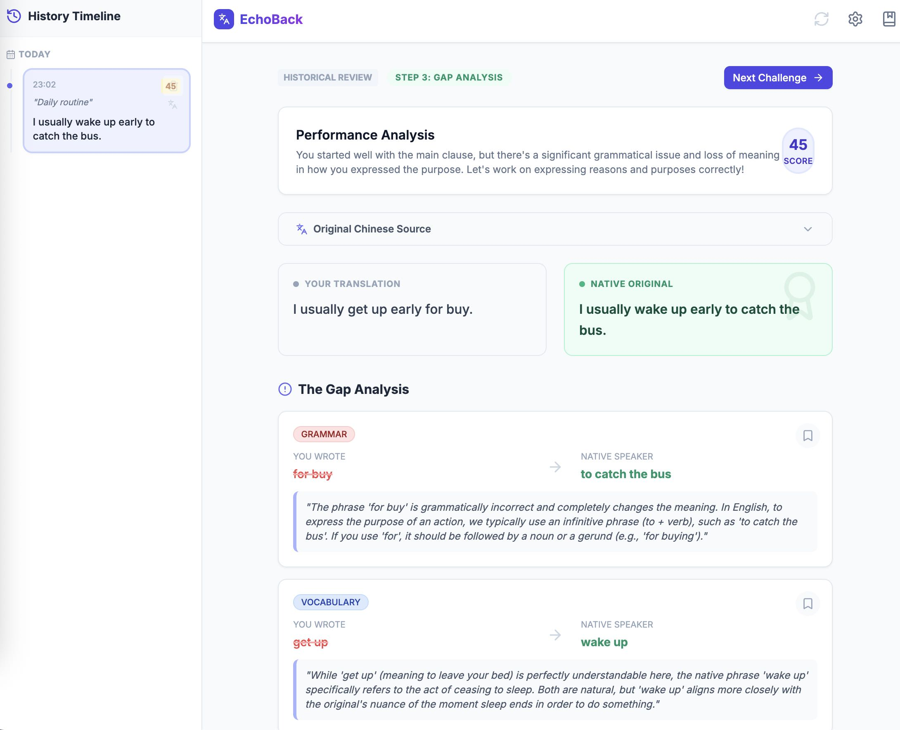

# EchoBack - 回译法英语学习工具

基于"回译法"的 AI 驱动英语学习工具。通过 AI 生成地道英语内容,帮助你完成"学习-隐藏-翻译"循环,并提供详细的差距分析来提升英语水平。

## ✨ 核心特性

- **多 AI 提供商支持**: 支持 Google Gemini 或 OpenAI API，根据需要灵活选择
- **回译学习流程**: 学习原文 → 隐藏原文 → 将中文翻译回英文 → AI 分析差距
- **详细差距分析**: 精准定位词汇、语法、语气、结构等方面的差异，并提供评分(0-100)
- **错题本功能**: 保存特定错误到个人笔记本，支持标记为已掌握
- **历史记录时间线**: 基于 IndexedDB 自动保存所有练习记录，可随时回顾
- **WebDAV 云同步**: 可选配置 WebDAV 服务实现多设备数据同步
- **灵活设置**: 自定义难度(Beginner/Intermediate/Advanced/Expert)、主题(日常/商务/学术等)、内容长度

## 📸 截图



## 🚀 快速开始

### 前置要求

- Node.js 18+
- AI API Key (二选一):
  - Google Gemini API Key ([获取地址](https://aistudio.google.com/apikey))
  - OpenAI API Key 或兼容的第三方 API

### 安装步骤

1. **克隆项目**
```bash
git clone <repository-url>
cd EchoBack
```

2. **安装依赖**
```bash
npm install
```

3. **启动开发服务器**
```bash
npm run dev
```

4. **配置 AI 服务**

首次访问 http://localhost:3000 时，点击右上角设置图标，在 **AI Settings** 选项卡中配置：

- **使用 Gemini**：输入 Gemini API Key
- **使用 OpenAI**：输入 OpenAI API Key，可选配置 Base URL 和 Model

配置保存在浏览器 localStorage，支持通过 WebDAV 同步

### 构建生产版本

```bash
npm run build
npm run preview  # 预览生产构建
```

## 🎯 使用方法

1. **配置 AI**: 在设置中选择 AI 提供商并配置 API Key
2. **配置学习参数**: 选择难度、主题和内容长度
3. **开始练习**: 点击"Start New Session"获取 AI 生成的英语内容
4. **学习阶段**: 仔细阅读英文原文和中文翻译
5. **翻译阶段**: 点击"I'm Ready to Translate"，尝试将中文翻译回英文
6. **获取分析**: 提交翻译后，AI 会分析你的翻译与原文的差距
7. **复习巩固**: 查看差距分析，将重要错误保存到错题本，定期复习

## 🛠️ 技术栈

- **前端框架**: React 19.2 + TypeScript
- **构建工具**: Vite
- **AI 服务**: Google Gemini API / OpenAI API (可选)
- **数据持久化**: IndexedDB + localStorage
- **远程同步**: WebDAV (可选)
- **样式**: Tailwind CSS

## 📁 项目结构

```
EchoBack/
├── components/           # React 组件
│   ├── AnalysisCard.tsx
│   ├── Button.tsx
│   ├── Notebook.tsx
│   ├── SettingsModal.tsx  # 设置面板（含 AI 配置）
│   └── Sidebar.tsx
├── services/            # 核心服务
│   ├── aiService.ts     # AI 服务（支持 Gemini/OpenAI）
│   ├── db.ts           # IndexedDB
│   └── webdav.ts       # WebDAV 同步
├── types.ts            # TypeScript 类型定义
├── App.tsx             # 主应用逻辑
├── index.tsx
├── MIGRATION.md        # 迁移指南
└── vite.config.ts
```

## ⚙️ 配置说明

### AI 配置

在设置面板的 **AI Settings** 选项卡中配置：

**Gemini 配置**:
- API Key: 在 [Google AI Studio](https://aistudio.google.com/apikey) 获取
- 模型: gemini-2.5-flash

**OpenAI 配置**:
- API Key: 你的 OpenAI API Key
- Base URL (可选): 默认 `https://api.openai.com/v1`，支持自定义（如 Azure OpenAI、第三方代理）
- Model (可选): 默认 `gpt-4o-mini`，可选 `gpt-4o`、`gpt-4-turbo` 等

### WebDAV 同步配置

在设置面板的 **Sync** 选项卡中配置：

1. 配置 WebDAV 服务器信息：
   - Server URL: WebDAV 服务器地址
   - Username: 用户名
   - Password: 密码
   - 勾选"Enable Sync"启用同步

2. 应用启动时会自动：
   - 加载本地 IndexedDB 数据
   - 从 WebDAV 服务器拉取远程数据
   - 按 ID 去重合并数据
   - 将合并结果同步到本地和远程

3. 支持的 WebDAV 服务：
   - 坚果云
   - Nextcloud
   - ownCloud
   - Fastmail
   - Koofr
   - 其他标准 WebDAV 服务

## 📝 开发说明

详细的架构说明和开发指南请参考：
- [CLAUDE.md](./CLAUDE.md) - 项目架构和开发指南

核心设计：
- **状态机模式**: 使用严格的状态机管理学习流程(IDLE → GENERATING → STUDY → INPUT → ANALYZING → REVIEW)
- **三层存储策略**: React State(内存) → IndexedDB(本地) → WebDAV(远程)
- **多 AI 提供商**: 统一接口，支持 Gemini 和 OpenAI
- **类型安全**: 完整的 TypeScript 类型系统


## 📄 License

MIT

## 🙏 致谢

- [Google Gemini](https://ai.google.dev/) - AI 能力支持
- [OpenAI](https://openai.com/) - AI 能力支持
- [Vite](https://vitejs.dev/) - 快速构建工具
- [React](https://react.dev/) - 前端框架
